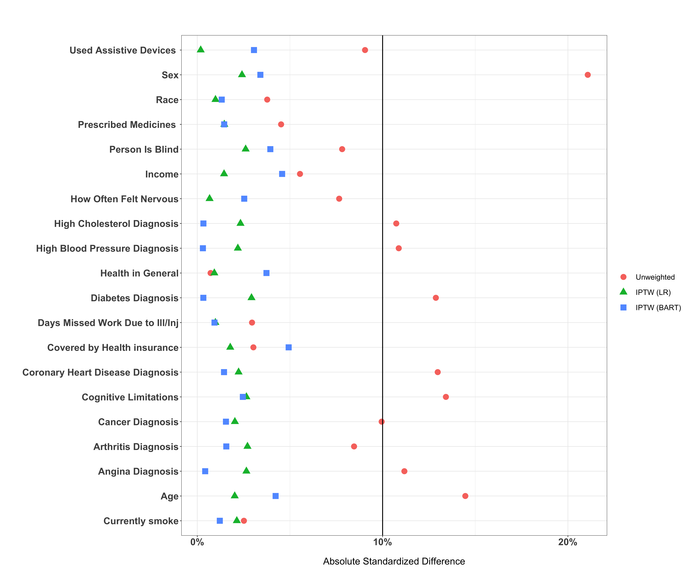
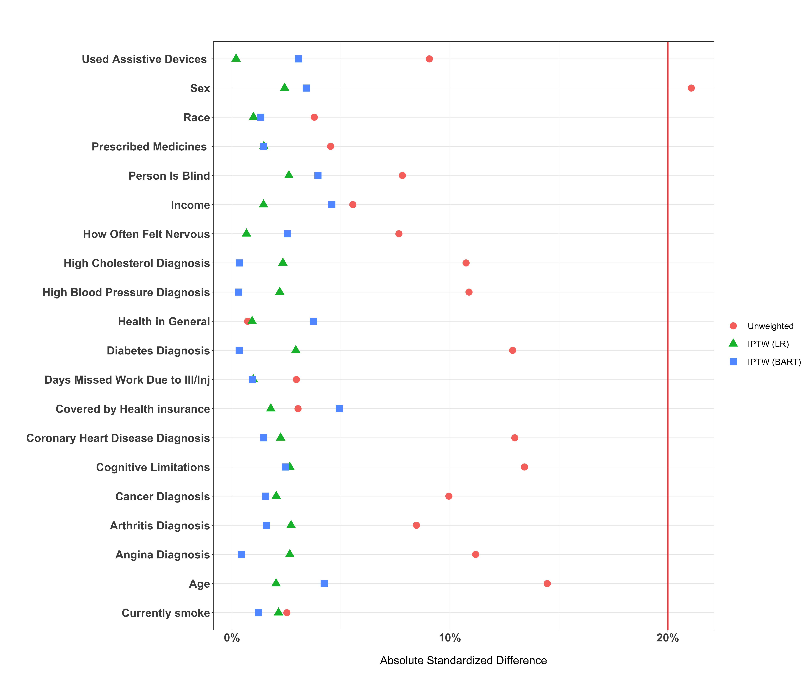
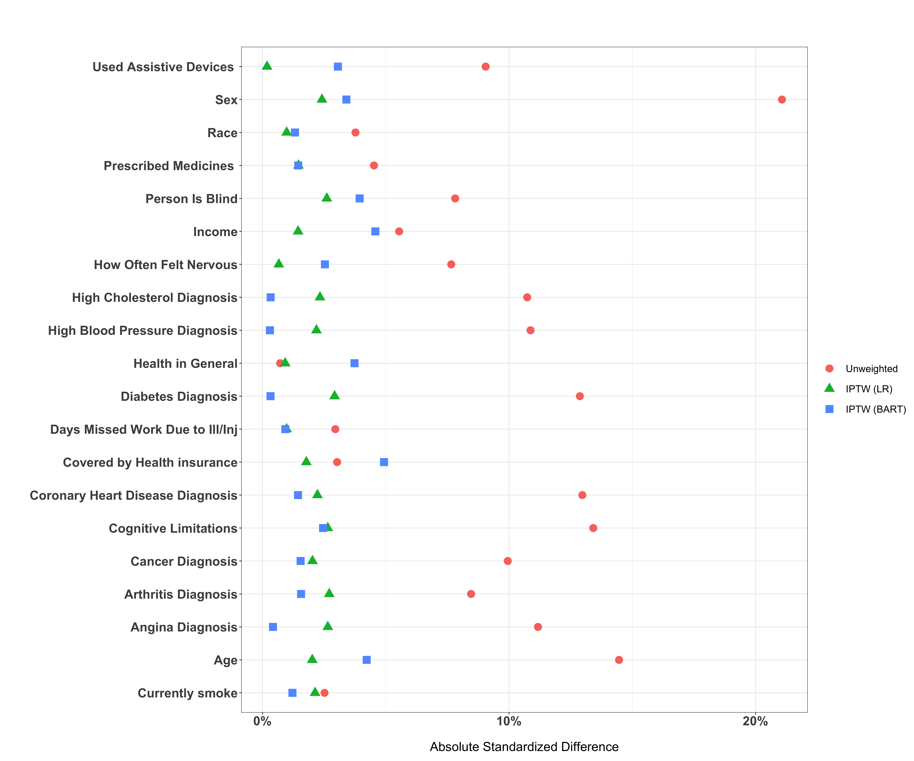

<!-- README.md is generated from README.Rmd. Please edit that file -->

# ASDplot

<!-- badges: start -->

<!-- badges: end -->

In observational studies, inverse probability of treatment weighting
(IPTW) is used to adjust for measured confounders in order to mitigate
the observed systematic differences between study groups. Several
diagnostic methods have been proposed to examine whether weighted
samples achieved balance one of which is the absolute standardized
differences (ASD) [Austin and
Stuart 2015](https://onlinelibrary.wiley.com/doi/10.1002/sim.6607).
*ASDplot* provides a simple R function based on ggplot2 to assess the
ASD before and after weighting to supplement the data analysis with
visualizations of sample differences.

## Installation

You can install the development version of ASDplot from
[GitHub](https://github.com/yalbogami/ASDplot) with:

``` r
# install.packages("devtools")
devtools::install_github("yalbogami/ASDplot")
```

## Requirements

To use ASDplot, a data frame must have the following columns:

  - 1- Variables’ names

  - 2- Absolute Standardized differences (ASD) values as proportions and

  - 3- Methods used to obtain the ASD (e.g., unadjusted, weighted, etc)

<!-- end list -->

``` r
ASDplot(data=data,
        x=data$Variables,
        y= data$ASD,
        shape=data$Methods,
        methods=c('Method 1', 'Method 2', 'Method 3'))
```

## The Following example is only intended to demonstrate ASDplot utility

In this example, we used MEPS 2017 datasets to weight the sample based
on IPTW to achieve a balance between inhaled corticosteroids and
leukotriene antagonists for asthma users. We estimated the propensity
scores, from which IPTW was calculated, using two different methods
1-logistic regression and 2-Bayesian additive regression trees.

### Downloading and cleaning the datasets

``` r
library(ASDplot)
library(tableone)
library(survey)
library(tidyverse)
library(haven)
library(labelled)
library(foreign)
library(BART)

#Data 1: Full Year Dataset
download.file("https://meps.ahrq.gov/mepsweb/data_files/pufs/h201ssp.zip", temp <- tempfile())
unzipped_file = unzip(temp)
h201 = read.xport(unzipped_file)
unlink(temp)  
save(h201, file = "h201.Rdata")

#Data 2: Rx Dataset
download.file("https://meps.ahrq.gov/mepsweb/data_files/pufs/h197assp.zip", temp <- tempfile())
unzipped_file = unzip(temp)
h197a = read.xport(unzipped_file)
unlink(temp)  
save(h197a, file = "h197a.Rdata")

#Read and clean downloaded data into R
load(file = "h201.Rdata")
h201 <- h201 %>%
  filter(ASSTIL31==1) %>%
  select(c('ADGENH42', 'ADNERV42', 'ADSMOK42', 'AGE17X', 'AIDHLP31', 'ANGIDX', 'ARTHDX', 'BLIND42', 'BUSNP17X', 'CANCERDX', 'CHDDX', 'CHOLDX', 'CINCOV31', 'COGLIM31', 'DDNWRK17', 'DIABDX', 'HIBPDX', 'RACETHX', 'RXTOT17', 'SEX', 'DUPERSID')) 

load(file = "h197a.Rdata")

LTRA <- c('MONTELUKAST', 'ZAFIRLUKAST', 'ZILEUTON')

ICS <- c('FLUTICASONE','BECLOMETHASONE', 'BUDESONIDE', 'CICLESONIDE', 'FLUNISOLIDE', 'MOMETASONE')

h197a <- h197a %>%
  mutate(Exposure = ifelse(str_detect(RXDRGNAM, paste((LTRA), collapse = '|')), 1,
                           ifelse(str_detect(RXDRGNAM, paste((ICS), collapse = '|')), 0, 2)),
         FLAG = ifelse(str_detect(RXDRGNAM, paste(c('TOPICAL', 'NASAL'), collapse = '|')), 1, 0)) %>%
  filter(Exposure %in% c(0,1)) %>%
  filter(FLAG==0) %>%
  distinct(DUPERSID, .keep_all = TRUE) %>%
  select(c(DUPERSID, Exposure))
data = inner_join(h201, h197a, by = "DUPERSID")

labels <- list(ADGENH42= 'Health in General',
               ADNERV42= 'How Often Felt Nervous',
               ADSMOK42= ' Currently smoke',
               AGE17X= 'Age',
               AIDHLP31= 'Used Assistive Devices ',
               ANGIDX= 'Angina Diagnosis',
               ARTHDX= 'Arthritis Diagnosis',
               BLIND42= 'Person Is Blind',
               BUSNP17X= 'Income',
               CANCERDX= 'Cancer Diagnosis',
               CHDDX= 'Coronary Heart Disease Diagnosis',
               CHOLDX= 'High Cholesterol Diagnosis',
               CINCOV31= 'Covered by Health insurance',
               COGLIM31= 'Cognitive Limitations',
               DDNWRK17= 'Days Missed Work Due to Ill/Inj',
               DIABDX= 'Diabetes Diagnosis',
               HIBPDX= 'High Blood Pressure Diagnosis',
               RACETHX= 'Race',
               RXTOT17= 'Prescribed Medicines ',
               SEX= 'Sex')

var_label(data) <- labels
```

### Estimating propensity scores and IPTW using logistic regression

``` r
psmodel <- glm(Exposure ~ ADGENH42+ ADNERV42+ ADSMOK42+ AGE17X+ AIDHLP31+ ANGIDX+ ARTHDX+ BLIND42+ BUSNP17X+ CANCERDX+ CHDDX+ CHOLDX+ CINCOV31+ COGLIM31+ DDNWRK17+ DIABDX+ HIBPDX+ RACETHX+ RXTOT17+ SEX,
               family= binomial(link='logit'), data = data)
ps <- predict(psmodel, type='response')
data$ps <- ps
data$iptw <- ifelse(data$Exposure==1, (1/data$ps), (1/(1-data$ps)))
```

### Estimating propensity scores and IPTW using Bayesian additive regression trees

``` r
set.seed(1)
bart <- Filter(function(x)(length(unique(x))>1), data)

x_train <- select(bart, -c(Exposure,DUPERSID, ps, iptw))
x_train <- bartModelMatrix(as.data.frame(x_train))
y_train <- data$Exposure
prob <- pbart(x_train, y_train)
ps_bart <- prob$prob.train.mean
data$ps_bart <- ps_bart
data$iptw_bart <- ifelse(data$Exposure==1, (1/data$ps_bart), (1/(1-data$ps_bart)))
```

### Selecting variables to include in the final plot

``` r
myVars <- c('ADGENH42', 'ADNERV42', 'ADSMOK42', 'AGE17X', 'AIDHLP31', 'ANGIDX', 'ARTHDX', 'BLIND42', 'BUSNP17X', 'CANCERDX', 'CHDDX', 'CHOLDX', 'CINCOV31', 'COGLIM31', 'DDNWRK17', 'DIABDX', 'HIBPDX', 'RACETHX', 'RXTOT17', 'SEX')
```

### Extracting ASD before and after weighting and create one data frame

``` r
#create table 1 before weighting
t1_before <- CreateTableOne(vars = myVars, strata = "Exposure" , data = data)
t1_before <- as.data.frame(ExtractSmd(t1_before,varLabels=T))
t1_before$variables <- rownames(t1_before)
t1_before$Method <- 1
t1_before$ASD <- t1_before$`1 vs 2`
t1_before <- t1_before %>%
  select(c(variables,Method,ASD))

#create table 1 after weighting using iptw (logistic regression)
data_weight1 <- svydesign(id = ~0, weights = ~iptw, data = data)
t1_after_iptw = svyCreateTableOne(vars = myVars, strata = "Exposure",  data = data_weight1, smd=T)
t1_after_iptw <- as.data.frame(ExtractSmd(t1_after_iptw, varLabels=T))
t1_after_iptw$variables <- rownames(t1_after_iptw)
t1_after_iptw$Method <- 2
t1_after_iptw$ASD <- t1_after_iptw$`1 vs 2`
t1_after_iptw <- t1_after_iptw %>%
  select(c(variables,Method,ASD))

#create table 1 after weighting using iptw (BART)
data_weight2 <- svydesign(id = ~0, weights = ~iptw_bart, data = data)
t1_after_iptw_sl = svyCreateTableOne(vars = myVars, strata = "Exposure",  data = data_weight2, smd=T)
t1_after_iptw_sl <- as.data.frame(ExtractSmd(t1_after_iptw_sl, varLabels=T))
t1_after_iptw_sl$variables <- rownames(t1_after_iptw_sl)
t1_after_iptw_sl$Method <- 3
t1_after_iptw_sl$ASD <- t1_after_iptw_sl$`1 vs 2`
t1_after_iptw_sl <- t1_after_iptw_sl %>%
  select(c(variables,Method,ASD))

#Combine and clean the tables
plot <- as.data.frame(rbind(t1_before,t1_after_iptw, t1_after_iptw_sl)) %>%
  select(c(variables,Method,ASD))
```

### Using ASDplot to plot sample differences

``` r
ASDplot(data=plot,
        x=plot$variables,
        y= plot$ASD,
        shape=plot$Method,
        methods=c('Unweighted', 'IPTW (LR)', 'IPTW (BART)'))

# to save the file use the following code
## ggsave("Figure 1.png",  units="in", width=18, height=15, dpi=300)
```



### To change the position, color and size of the cutoff bar, use the following parameters:

  - intercept\_position,
  - intercept\_color and
  - intercept\_size

<!-- end list -->

``` r
ASDplot(data=plot,
        x=plot$variables,
        y= plot$ASD,
        shape=plot$Method,
        intercept_position=0.2,
        intercept_color='red',
        methods=c('Unweighted', 'IPTW (LR)', 'IPTW (BART)'))
```



### To remove the cutoff bar, change the following parameter to false:

  - switch

<!-- end list -->

``` r
ASDplot(data=plot,
        x=plot$variables,
        y= plot$ASD,
        shape=plot$Method,
        switch = F,
        methods=c('Unweighted', 'IPTW (LR)', 'IPTW (BART)'))
```


